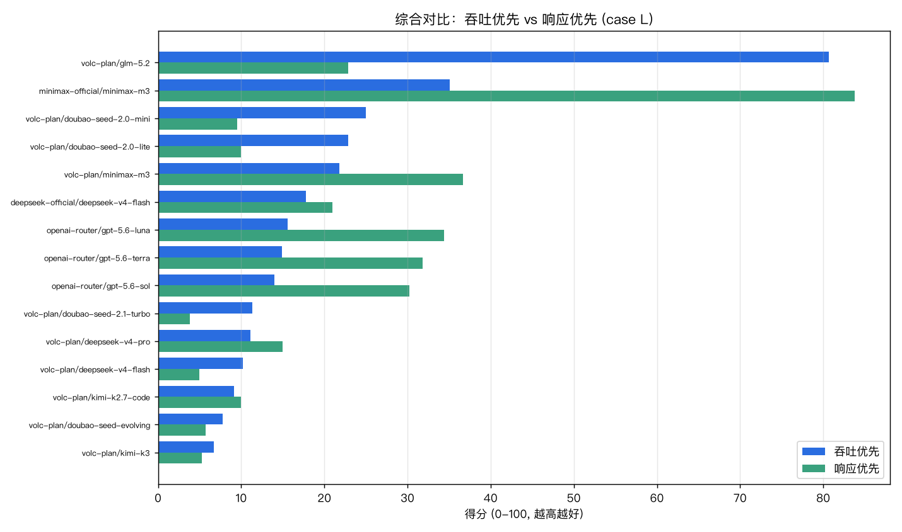
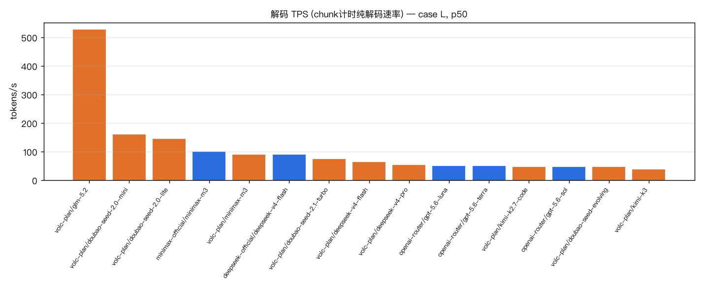
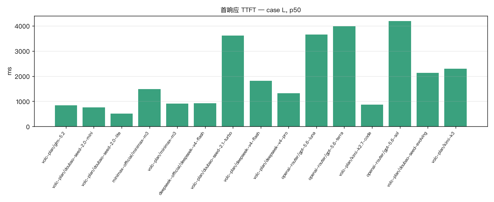
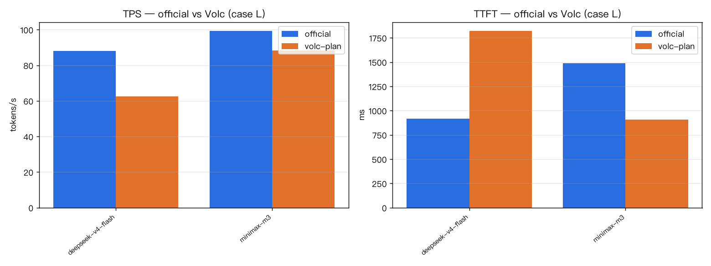
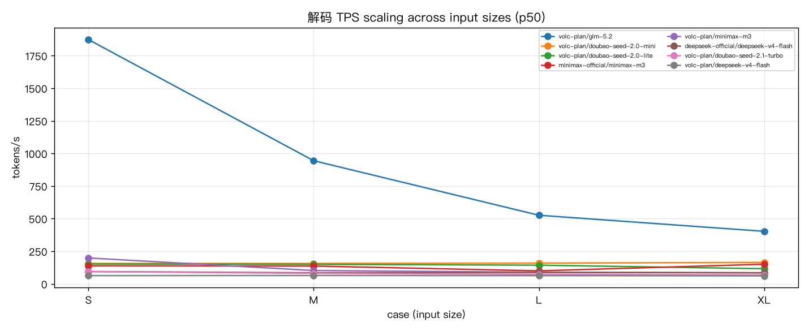
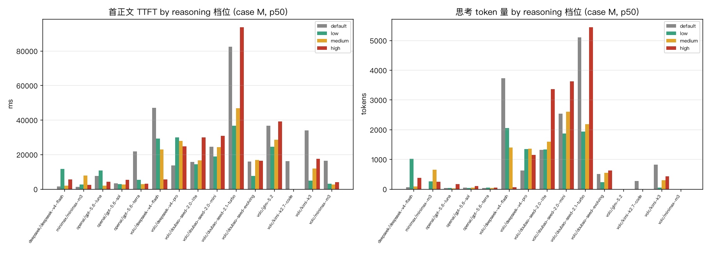

# 模型性能 Benchmark 报告

- 数据源: `raw_20260808_120156.jsonl`
- 总样本: 900 次请求，覆盖 15 个端点/模型组合
- 协议: 全部走 OpenAI **Responses API**（stream=true）
- 指标: **首响应TTFT**=首个任意输出(reasoning 模型=首思考, 普通=首正文)；**首正文TTFT**=首个可见答案 token(reasoning 模型需先想完)；**解码TPS**=正文token/(末chunk−首chunk) 纯解码速率(chunk计时,不受思考/usage缺失影响)；**端到端TPS**=正文token/总时长(最接近体感)；E2E=请求→completed

## 一、核心对比（case L：in~4k / out~1k，p50）

| 端点/模型 | 来源 | 首响应TTFT(ms) | 首正文TTFT(ms) | 解码TPS(tok/s) | 端到端TPS(体感) | E2E(s) | 成功率 |
|---|---|---|---|---|---|---|---|
| 🧠volc-plan/glm-5.2 | 🟠Volc | 846 | 41726 | **525.8** | 98.0 | 50.0 | 100% |
| 🧠volc-plan/doubao-seed-2.0-mini | 🟠Volc | 760 | 34678 | **158.7** | 26.9 | 41.0 | 100% |
| 🧠volc-plan/doubao-seed-2.0-lite | 🟠Volc | 512 | 25847 | **142.8** | 29.6 | 33.0 | 100% |
| minimax-official/minimax-m3 | 🔵官方 | 1489 | 1489 | **99.2** | 86.8 | 12.4 | 100% |
| 🧠volc-plan/minimax-m3 | 🟠Volc | 910 | 3573 | **88.3** | 71.9 | 16.4 | 100% |
| 🧠deepseek-official/deepseek-v4-flash | 🔵官方 | 918 | 6733 | **88.0** | 59.9 | 22.6 | 100% |
| 🧠volc-plan/doubao-seed-2.1-turbo | 🟠Volc | 3609 | 110967 | **72.7** | 9.0 | 125.4 | 100% |
| 🧠volc-plan/deepseek-v4-flash | 🟠Volc | 1820 | 45446 | **62.7** | 21.0 | 66.7 | 100% |
| 🧠volc-plan/deepseek-v4-pro | 🟠Volc | 1321 | 9120 | **51.8** | 38.9 | 39.4 | 100% |
| gpt-gateway/gpt-5.6-luna | 🔵官方 | 3660 | 3660 | **49.1** | 39.7 | 24.6 | 100% |
| gpt-gateway/gpt-5.6-terra | 🔵官方 | 3979 | 3979 | **49.0** | 40.4 | 25.0 | 100% |
| 🧠volc-plan/kimi-k2.7-code | 🟠Volc | 863 | 14450 | **46.1** | 27.6 | 37.1 | 100% |
| gpt-gateway/gpt-5.6-sol | 🔵官方 | 4187 | 4187 | **45.0** | 35.9 | 30.6 | 100% |
| 🧠volc-plan/doubao-seed-evolving | 🟠Volc | 2133 | 29913 | **44.8** | 20.6 | 57.5 | 100% |
| 🧠volc-plan/kimi-k3 | 🟠Volc | 2297 | 30350 | **37.5** | 19.8 | 65.0 | 100% |

> 🧠=reasoning 模型。**解码TPS**=纯解码速率（chunk计时）；**端到端TPS**=含首延迟摊薄，最接近日常体感。deepseek 官方 flash 首正文仅 ~1.3s、几乎不思考，交互最跟手；glm-5.2 解码爆发最快但需先思考数十秒。

## 二、综合对比报表（case L）

> 双维度评分（0-100，越高越好）：**吞吐优先**=80%解码TPS+20%首正文TTFT（长文/批量生成）；**响应优先**=80%首正文TTFT+20%解码TPS（交互式 Agent，首延迟为王）。单一分数会误导——glm-5.2 吞吐第一但首正文 56s，交互场景垫底；按需选列。

| # | 端点/模型 | 源 | 吞吐优先 | 响应优先 | 首正文TTFT(ms) | 解码TPS | 端到端TPS | E2E(s) | 成功率 |
|---|---|---|---|---|---|---|---|---|---|
| 1 | 🧠volc-plan/glm-5.2 | 🟠 | **80.7** | **22.9** | 41726 | 525.8 | 98.0 | 50.0 | 100% |
| 2 | minimax-official/minimax-m3 | 🔵 | **35.1** | **83.8** | 1489 | 99.2 | 86.8 | 12.4 | 100% |
| 3 | 🧠volc-plan/doubao-seed-2.0-mini | 🟠 | **25.0** | **9.5** | 34678 | 158.7 | 26.9 | 41.0 | 100% |
| 4 | 🧠volc-plan/doubao-seed-2.0-lite | 🟠 | **22.9** | **10.0** | 25847 | 142.8 | 29.6 | 33.0 | 100% |
| 5 | 🧠volc-plan/minimax-m3 | 🟠 | **21.8** | **36.7** | 3573 | 88.3 | 71.9 | 16.4 | 100% |
| 6 | 🧠deepseek-official/deepseek-v4-flash | 🔵 | **17.8** | **21.0** | 6733 | 88.0 | 59.9 | 22.6 | 100% |
| 7 | gpt-gateway/gpt-5.6-luna | 🔵 | **15.6** | **34.4** | 3660 | 49.1 | 39.7 | 24.6 | 100% |
| 8 | gpt-gateway/gpt-5.6-terra | 🔵 | **14.9** | **31.8** | 3979 | 49.0 | 40.4 | 25.0 | 100% |
| 9 | gpt-gateway/gpt-5.6-sol | 🔵 | **14.0** | **30.2** | 4187 | 45.0 | 35.9 | 30.6 | 100% |
| 10 | 🧠volc-plan/doubao-seed-2.1-turbo | 🟠 | **11.3** | **3.8** | 110967 | 72.7 | 9.0 | 125.4 | 100% |
| 11 | 🧠volc-plan/deepseek-v4-pro | 🟠 | **11.1** | **15.0** | 9120 | 51.8 | 38.9 | 39.4 | 100% |
| 12 | 🧠volc-plan/deepseek-v4-flash | 🟠 | **10.2** | **5.0** | 45446 | 62.7 | 21.0 | 66.7 | 100% |
| 13 | 🧠volc-plan/kimi-k2.7-code | 🟠 | **9.1** | **10.0** | 14450 | 46.1 | 27.6 | 37.1 | 100% |
| 14 | 🧠volc-plan/doubao-seed-evolving | 🟠 | **7.8** | **5.7** | 29913 | 44.8 | 20.6 | 57.5 | 100% |
| 15 | 🧠volc-plan/kimi-k3 | 🟠 | **6.7** | **5.3** | 30350 | 37.5 | 19.8 | 65.0 | 100% |

## 三、分负载明细（p50 / p95）

### case S

| 端点/模型 | 首响应ms | 首正文ms | 解码TPS (p50/p95) | TPS σ | E2E s (p50/p95) | 输出tok | 成功率 |
|---|---|---|---|---|---|---|---|
| 🧠volc-plan/glm-5.2 | 977 | 21588 | 1873.5 / 2415.7 | 480.14 | 23.29 / 36.08 | 2806 | 100% (10/10) |
| 🧠volc-plan/minimax-m3 | 641 | 1870 | 198.2 / 287.3 | 38.01 | 4.24 / 6.97 | 447 | 100% (10/10) |
| 🧠volc-plan/doubao-seed-2.0-mini | 483 | 11571 | 155.9 / 224.4 | 26.91 | 13.35 / 23.82 | 1658 | 100% (10/10) |
| 🧠volc-plan/doubao-seed-2.0-lite | 553 | 7551 | 151.9 / 174.4 | 10.75 | 9.06 / 17.18 | 1060 | 100% (10/10) |
| minimax-official/minimax-m3 | 1046 | 1046 | 138.0 / 184.8 | 52.72 | 4.00 / 13.27 | 313 | 100% (10/10) |
| 🧠deepseek-official/deepseek-v4-flash | 946 | 1900 | 94.1 / 107.7 | 7.16 | 4.64 / 7.62 | 348 | 100% (10/10) |
| 🧠volc-plan/doubao-seed-2.1-turbo | 3024 | 85798 | 93.4 / 172.6 | 25.03 | 88.52 / 166.88 | 5430 | 100% (10/10) |
| 🧠volc-plan/deepseek-v4-pro | 953 | 22375 | 67.8 / 184.6 | 36.95 | 25.24 / 81.49 | 1519 | 100% (10/10) |
| 🧠volc-plan/deepseek-v4-flash | 1375 | 31395 | 62.7 / 75.1 | 6.79 | 36.33 / 94.58 | 1672 | 100% (10/10) |
| 🧠volc-plan/doubao-seed-evolving | 1993 | 14129 | 61.8 / 163.7 | 40.84 | 18.72 / 52.13 | 784 | 100% (10/10) |
| gpt-gateway/gpt-5.6-terra | 5440 | 5440 | 54.8 / 83.0 | 2342.61 | 8.58 / 15.30 | 248 | 100% (10/10) |
| 🧠volc-plan/kimi-k3 | 1505 | 31254 | 52.6 / 68.2 | 6.67 | 36.59 / 72.31 | 1444 | 100% (10/10) |
| gpt-gateway/gpt-5.6-sol | 2938 | 2938 | 52.2 / 147.9 | 31.70 | 8.55 / 12.35 | 300 | 100% (10/10) |
| gpt-gateway/gpt-5.6-luna | 2745 | 2745 | 51.5 / 59.3 | 3.54 | 7.18 / 13.78 | 248 | 100% (10/10) |
| 🧠volc-plan/kimi-k2.7-code | 897 | 22591 | 41.9 / 44.7 | 3.07 | 28.79 / 75.13 | 1074 | 100% (10/10) |

### case M

| 端点/模型 | 首响应ms | 首正文ms | 解码TPS (p50/p95) | TPS σ | E2E s (p50/p95) | 输出tok | 成功率 |
|---|---|---|---|---|---|---|---|
| 🧠volc-plan/glm-5.2 | 858 | 28888 | 944.1 / 1465.2 | 245.25 | 33.02 / 55.47 | 3642 | 100% (10/10) |
| 🧠volc-plan/doubao-seed-2.0-mini | 453 | 21907 | 156.1 / 163.3 | 6.07 | 25.85 / 35.46 | 3508 | 100% (10/10) |
| 🧠volc-plan/doubao-seed-2.0-lite | 654 | 14160 | 149.4 / 165.0 | 7.67 | 17.82 / 19.25 | 1902 | 100% (10/10) |
| minimax-official/minimax-m3 | 1102 | 1102 | 136.0 / 154.9 | 17.60 | 6.20 / 7.23 | 580 | 100% (10/10) |
| 🧠volc-plan/minimax-m3 | 865 | 3132 | 101.9 / 116.0 | 11.19 | 9.65 / 11.75 | 671 | 100% (10/10) |
| 🧠deepseek-official/deepseek-v4-flash | 603 | 2348 | 84.4 / 92.1 | 3.65 | 9.53 / 17.12 | 752 | 100% (10/10) |
| 🧠volc-plan/doubao-seed-2.1-turbo | 3096 | 109126 | 80.0 / 85.7 | 4.91 | 116.97 / 213.11 | 6776 | 100% (10/10) |
| 🧠volc-plan/deepseek-v4-flash | 1466 | 46716 | 63.7 / 80.7 | 8.20 | 58.40 / 194.02 | 3027 | 100% (10/10) |
| 🧠volc-plan/doubao-seed-evolving | 1933 | 27547 | 58.9 / 107.1 | 21.18 | 37.54 / 55.79 | 1638 | 100% (10/10) |
| gpt-gateway/gpt-5.6-terra | 2627 | 2627 | 56.5 / 59.4 | 6.82 | 11.86 / 16.72 | 534 | 100% (10/10) |
| 🧠volc-plan/deepseek-v4-pro | 911 | 8609 | 52.2 / 69.6 | 5.90 | 22.85 / 38.91 | 1148 | 100% (10/10) |
| gpt-gateway/gpt-5.6-luna | 3671 | 3671 | 48.7 / 52.8 | 2.09 | 13.21 / 42.01 | 488 | 100% (10/10) |
| 🧠volc-plan/kimi-k2.7-code | 884 | 11040 | 44.6 / 51.4 | 4.28 | 24.66 / 100.99 | 954 | 100% (10/10) |
| 🧠volc-plan/kimi-k3 | 3090 | 20893 | 36.0 / 46.9 | 4.60 | 37.26 / 60.54 | 1269 | 100% (10/10) |
| gpt-gateway/gpt-5.6-sol | 3367 | 3367 | 30.5 / 39.2 | 3.78 | 21.56 / 27.18 | 600 | 100% (10/10) |

### case L

| 端点/模型 | 首响应ms | 首正文ms | 解码TPS (p50/p95) | TPS σ | E2E s (p50/p95) | 输出tok | 成功率 |
|---|---|---|---|---|---|---|---|
| 🧠volc-plan/glm-5.2 | 846 | 41726 | 525.8 / 2198.9 | 540.47 | 50.00 / 92.02 | 4901 | 100% (10/10) |
| 🧠volc-plan/doubao-seed-2.0-mini | 760 | 34678 | 158.7 / 173.6 | 9.28 | 40.99 / 45.58 | 5674 | 100% (10/10) |
| 🧠volc-plan/doubao-seed-2.0-lite | 512 | 25847 | 142.8 / 154.1 | 18.67 | 32.95 / 36.80 | 3608 | 100% (10/10) |
| minimax-official/minimax-m3 | 1489 | 1489 | 99.2 / 130.5 | 13.77 | 12.41 / 19.82 | 1081 | 100% (10/10) |
| 🧠volc-plan/minimax-m3 | 910 | 3573 | 88.3 / 111.1 | 11.20 | 16.36 / 19.19 | 1176 | 100% (10/10) |
| 🧠deepseek-official/deepseek-v4-flash | 918 | 6733 | 88.0 / 102.8 | 5.85 | 22.62 / 41.88 | 1923 | 100% (10/10) |
| 🧠volc-plan/doubao-seed-2.1-turbo | 3609 | 110967 | 72.7 / 82.1 | 5.28 | 125.37 / 165.32 | 6902 | 100% (10/10) |
| 🧠volc-plan/deepseek-v4-flash | 1820 | 45446 | 62.7 / 71.7 | 6.89 | 66.68 / 101.36 | 3472 | 100% (10/10) |
| 🧠volc-plan/deepseek-v4-pro | 1321 | 9120 | 51.8 / 59.1 | 2.31 | 39.36 / 65.09 | 1996 | 100% (10/10) |
| gpt-gateway/gpt-5.6-luna | 3660 | 3660 | 49.1 / 51.1 | 1.65 | 24.60 / 31.58 | 1022 | 100% (10/10) |
| gpt-gateway/gpt-5.6-terra | 3979 | 3979 | 49.0 / 52.7 | 1.43 | 25.00 / 29.61 | 1033 | 100% (10/10) |
| 🧠volc-plan/kimi-k2.7-code | 863 | 14450 | 46.1 / 48.2 | 1.55 | 37.15 / 67.11 | 1636 | 100% (10/10) |
| gpt-gateway/gpt-5.6-sol | 4187 | 4187 | 45.0 / 61.3 | 12.78 | 30.61 / 48.81 | 1125 | 100% (10/10) |
| 🧠volc-plan/doubao-seed-evolving | 2133 | 29913 | 44.8 / 46.4 | 1.32 | 57.50 / 75.49 | 2302 | 100% (10/10) |
| 🧠volc-plan/kimi-k3 | 2297 | 30350 | 37.5 / 44.1 | 3.43 | 65.05 / 105.10 | 2410 | 100% (10/10) |

### case XL

| 端点/模型 | 首响应ms | 首正文ms | 解码TPS (p50/p95) | TPS σ | E2E s (p50/p95) | 输出tok | 成功率 |
|---|---|---|---|---|---|---|---|
| 🧠volc-plan/glm-5.2 | 1096 | 57754 | 402.5 / 1092.3 | 241.82 | 78.00 / 114.69 | 7277 | 100% (10/10) |
| 🧠volc-plan/doubao-seed-2.0-mini | 749 | 46035 | 163.8 / 173.8 | 11.98 | 63.67 / 77.31 | 9074 | 100% (10/10) |
| minimax-official/minimax-m3 | 1438 | 1438 | 150.1 / 178.4 | 28.32 | 12.22 / 22.19 | 1464 | 100% (10/10) |
| 🧠volc-plan/doubao-seed-2.0-lite | 848 | 37397 | 115.7 / 155.5 | 13.62 | 52.67 / 65.25 | 5512 | 100% (10/10) |
| 🧠volc-plan/minimax-m3 | 952 | 3137 | 84.4 / 101.3 | 8.81 | 23.93 / 29.87 | 1821 | 100% (10/10) |
| 🧠deepseek-official/deepseek-v4-flash | 842 | 16477 | 84.3 / 89.9 | 2.87 | 87.73 / 120.69 | 7209 | 100% (10/10) |
| 🧠volc-plan/doubao-seed-2.1-turbo | 3644 | 211184 | 67.9 / 74.0 | 3.19 | 250.69 / 335.18 | 12974 | 100% (10/10) |
| 🧠volc-plan/deepseek-v4-flash | 2156 | 83433 | 60.7 / 113.1 | 18.71 | 138.05 / 253.00 | 6826 | 90% (9/10) |
| gpt-gateway/gpt-5.6-luna | 3068 | 3068 | 55.9 / 61.2 | 2.65 | 37.57 / 48.38 | 1980 | 100% (10/10) |
| gpt-gateway/gpt-5.6-terra | 4770 | 4770 | 55.7 / 56.0 | 0.39 | 51.37 / 64.42 | 2545 | 100% (10/10) |
| 🧠volc-plan/deepseek-v4-pro | 1222 | 7443 | 53.4 / 55.4 | 15.39 | 59.42 / 1280.04 | 3088 | 100% (10/10) |
| 🧠volc-plan/doubao-seed-evolving | 2622 | 61748 | 43.9 / 87.0 | 16.51 | 121.24 / 150.35 | 5149 | 100% (10/10) |
| 🧠volc-plan/kimi-k2.7-code | 990 | 9308 | 43.2 / 44.2 | 0.61 | 55.99 / 82.84 | 2432 | 100% (10/10) |
| 🧠volc-plan/kimi-k3 | 2300 | 33417 | 39.5 / 44.7 | 3.19 | 96.35 / 153.86 | 3503 | 100% (10/10) |
| gpt-gateway/gpt-5.6-sol | 4298 | 4298 | 35.5 / 44.8 | 3.81 | 63.10 / 78.16 | 2146 | 100% (10/10) |

### case agent

| 端点/模型 | 首响应ms | 首正文ms | 解码TPS (p50/p95) | TPS σ | E2E s (p50/p95) | 输出tok | 成功率 |
|---|---|---|---|---|---|---|---|
| 🧠volc-plan/kimi-k3 | 2071 | 8780 | 99.6 / 99.6 | 0.00 | 4.13 / 10.18 | 127 | 100% (10/10) |
| 🧠deepseek-official/deepseek-v4-flash | 911 | - | - / - | - | 1.64 / 1.94 | 118 | 100% (10/10) |
| minimax-official/minimax-m3 | - | - | - / - | - | 2.27 / 7.42 | 45 | 100% (10/10) |
| gpt-gateway/gpt-5.6-luna | - | - | - / - | - | 2.79 / 4.24 | 78 | 100% (10/10) |
| gpt-gateway/gpt-5.6-sol | - | - | - / - | - | 2.74 / 5.15 | 77 | 100% (10/10) |
| gpt-gateway/gpt-5.6-terra | - | - | - / - | - | 2.70 / 2.98 | 78 | 100% (10/10) |
| 🧠volc-plan/deepseek-v4-flash | 1417 | - | - / - | - | 3.25 / 4.18 | 105 | 100% (10/10) |
| 🧠volc-plan/deepseek-v4-pro | 900 | - | - / - | - | 3.17 / 4.60 | 112 | 100% (10/10) |
| 🧠volc-plan/doubao-seed-2.0-lite | 512 | - | - / - | - | 1.35 / 1.75 | 116 | 100% (10/10) |
| 🧠volc-plan/doubao-seed-2.0-mini | 485 | - | - / - | - | 2.21 / 2.38 | 231 | 100% (10/10) |
| 🧠volc-plan/doubao-seed-2.1-turbo | 3377 | - | - / - | - | 4.19 / 5.98 | 107 | 100% (10/10) |
| 🧠volc-plan/doubao-seed-evolving | 2081 | - | - / - | - | 2.71 / 3.10 | 132 | 100% (10/10) |
| 🧠volc-plan/glm-5.2 | 3712 | - | - / - | - | 4.11 / 4.56 | 58 | 100% (10/10) |
| 🧠volc-plan/kimi-k2.7-code | 926 | - | - / - | - | 2.92 / 3.38 | 79 | 100% (10/10) |
| 🧠volc-plan/minimax-m3 | 838 | - | - / - | - | 1.55 / 1.89 | 86 | 100% (10/10) |

## 四、官方直连 vs Volc Agent Plan（同模型）

| 模型 | 官方TTFT(ms) | Volc TTFT(ms) | ΔTTFT(ms) | 官方TPS | Volc TPS | ΔTPS | TPS更快 |
|---|---|---|---|---|---|---|---|
| deepseek-v4-flash | 918 | 1820 | 902 | 88.0 | 62.7 | -25.3 | 官方 |
| minimax-m3 | 1489 | 910 | -579 | 99.2 | 88.3 | -10.9 | 官方 |

> Δ 为正 = Volc 更慢/更高；ΔTPS 为正 = Volc 更快。

## 五、Agent 专项（tool_call 决策）

| 端点/模型 | tool_call首延迟(ms) | TTFT(ms) | E2E(s) | tool合法性 | 成功率 |
|---|---|---|---|---|---|
| volc-plan/doubao-seed-2.0-lite | 1132 | - | 1.35 | 100% | 100% |
| volc-plan/minimax-m3 | 1396 | - | 1.55 | 100% | 100% |
| deepseek-official/deepseek-v4-flash | 1400 | - | 1.64 | 100% | 100% |
| gpt-gateway/gpt-5.6-terra | 1849 | - | 2.70 | 100% | 100% |
| gpt-gateway/gpt-5.6-sol | 1901 | - | 2.74 | 100% | 100% |
| gpt-gateway/gpt-5.6-luna | 1922 | - | 2.79 | 100% | 100% |
| volc-plan/doubao-seed-2.0-mini | 2068 | - | 2.21 | 100% | 100% |
| minimax-official/minimax-m3 | 2237 | - | 2.27 | 100% | 100% |
| volc-plan/deepseek-v4-pro | 2389 | - | 3.17 | 100% | 100% |
| volc-plan/deepseek-v4-flash | 2411 | - | 3.25 | 100% | 100% |
| volc-plan/kimi-k2.7-code | 2618 | - | 2.92 | 100% | 100% |
| volc-plan/doubao-seed-evolving | 2628 | - | 2.71 | 100% | 100% |
| volc-plan/kimi-k3 | 3489 | - | 4.13 | 100% | 100% |
| volc-plan/glm-5.2 | 3988 | - | 4.11 | 100% | 100% |
| volc-plan/doubao-seed-2.1-turbo | 4030 | - | 4.19 | 100% | 100% |

## 六、Prompt Caching 效果

| 端点/模型 | 首次TTFT(ms) | 命中最优TTFT(ms) | TTFT降幅 | max cached_tokens | 检出缓存 |
|---|---|---|---|---|---|
| volc-plan/kimi-k2.7-code | 1755 | 934 | 46.8% | 5948 | ✅ |
| minimax-official/minimax-m3 | 1633 | 938 | 42.5% | 6016 | ✅ |
| volc-plan/minimax-m3 | 923 | 575 | 37.7% | 6104 | ✅ |
| volc-plan/kimi-k3 | 3746 | 2504 | 33.2% | 5888 | ✅ |
| volc-plan/doubao-seed-2.0-lite | 720 | 490 | 32.0% | 5944 | ✅ |
| volc-plan/deepseek-v4-flash | 2117 | 1500 | 29.1% | 6144 | ✅ |
| gpt-gateway/gpt-5.6-luna | 2276 | 1670 | 26.6% | 9984 | ✅ |
| deepseek-official/deepseek-v4-flash | 1062 | 897 | 15.6% | 6400 | ✅ |
| gpt-gateway/gpt-5.6-terra | 1970 | 1720 | 12.7% | 9984 | ✅ |
| volc-plan/doubao-seed-2.0-mini | 579 | 532 | 8.2% | 5944 | ✅ |
| gpt-gateway/gpt-5.6-sol | 1519 | 1413 | 7.0% | 9984 | ✅ |
| volc-plan/doubao-seed-evolving | 2220 | 2142 | 3.5% | 6130 | ✅ |
| volc-plan/glm-5.2 | 759 | 736 | 3.1% | 6016 | ✅ |
| volc-plan/doubao-seed-2.1-turbo | 3215 | 3378 | -5.1% | 5944 | ✅ |
| volc-plan/deepseek-v4-pro | 877 | 944 | -7.7% | 6144 | ✅ |

## 七、图表

## 八、Reasoning 档位影响（case M，p50）

> 同一模型在 default/low/medium/high 四档下的思考量、首正文延迟、内容TPS、E2E。**思考量与首正文TTFT随档位上升，内容TPS基本不变**——调高档位的代价在延迟，不在解码速度。

| 端点/模型 | 档位 | 思考tok | 正文tok | 首正文TTFT(ms) | 内容TPS | E2E(s) |
|---|---|---|---|---|---|---|
| deepseek/deepseek-v4-flash | default | 67 | 528 | 1449 | 75.9 | 9.2 |
| deepseek/deepseek-v4-flash | low | 1017 | 721 | 11650 | 95.5 | 20.9 |
| deepseek/deepseek-v4-flash | medium | 84 | 459 | 1852 | 83.5 | 7.3 |
| deepseek/deepseek-v4-flash | high | 371 | 703 | 5541 | 76.3 | 14.8 |
| minimax/minimax-m3 | default | 0 | 687 | 1229 | 122.3 | 7.2 |
| minimax/minimax-m3 | low | 254 | 505 | 2707 | 137.0 | 6.8 |
| minimax/minimax-m3 | medium | 655 | 500 | 7896 | 201.3 | 10.2 |
| minimax/minimax-m3 | high | 244 | 508 | 2310 | 124.6 | 6.3 |
| gpt-gateway/gpt-5.6-luna | default | 28 | 472 | 7572 | 46.6 | 17.5 |
| gpt-gateway/gpt-5.6-luna | low | 29 | 466 | 10691 | 43.6 | 21.9 |
| gpt-gateway/gpt-5.6-luna | medium | 27 | 464 | 1916 | 55.7 | 10.8 |
| gpt-gateway/gpt-5.6-luna | high | 171 | 438 | 4287 | 54.2 | 13.9 |
| gpt-gateway/gpt-5.6-sol | default | 41 | 586 | 3330 | 34.4 | 20.9 |
| gpt-gateway/gpt-5.6-sol | low | 40 | 553 | 2948 | 31.6 | 20.5 |
| gpt-gateway/gpt-5.6-sol | medium | 45 | 530 | 2722 | 33.0 | 20.6 |
| gpt-gateway/gpt-5.6-sol | high | 100 | 580 | 5242 | 34.5 | 20.9 |
| gpt-gateway/gpt-5.6-terra | default | 34 | 464 | 21831 | 1106.8 | 25.9 |
| gpt-gateway/gpt-5.6-terra | low | 52 | 476 | 5330 | 48.4 | 15.3 |
| gpt-gateway/gpt-5.6-terra | medium | 30 | 435 | 2798 | 54.9 | 11.2 |
| gpt-gateway/gpt-5.6-terra | high | 42 | 455 | 3088 | 55.2 | 11.0 |
| volc/deepseek-v4-flash | default | 3727 | 510 | 47105 | 100.0 | 54.9 |
| volc/deepseek-v4-flash | low | 2051 | 620 | 29299 | 67.7 | 38.6 |
| volc/deepseek-v4-flash | medium | 1391 | 626 | 22932 | 95.9 | 29.5 |
| volc/deepseek-v4-flash | high | 57 | 486 | 5581 | 60.5 | 14.2 |
| volc/deepseek-v4-pro | default | 620 | 754 | 13618 | 49.2 | 26.7 |
| volc/deepseek-v4-pro | low | 1339 | 690 | 29977 | 55.6 | 39.1 |
| volc/deepseek-v4-pro | medium | 1363 | 660 | 27934 | 49.6 | 40.4 |
| volc/deepseek-v4-pro | high | 1143 | 794 | 24801 | 48.3 | 41.3 |
| volc/doubao-seed-2.0-lite | default | 1323 | 526 | 15780 | 142.0 | 19.3 |
| volc/doubao-seed-2.0-lite | low | 1328 | 545 | 14449 | 144.6 | 18.0 |
| volc/doubao-seed-2.0-lite | medium | 1590 | 538 | 16519 | 154.8 | 20.2 |
| volc/doubao-seed-2.0-lite | high | 3359 | 568 | 29932 | 162.7 | 33.3 |
| volc/doubao-seed-2.0-mini | default | 2536 | 643 | 24552 | 147.3 | 29.1 |
| volc/doubao-seed-2.0-mini | low | 1861 | 672 | 18744 | 125.2 | 24.4 |
| volc/doubao-seed-2.0-mini | medium | 2604 | 678 | 24344 | 164.8 | 29.0 |
| volc/doubao-seed-2.0-mini | high | 3628 | 645 | 30703 | 139.1 | 35.3 |
| volc/doubao-seed-2.1-turbo | default | 5098 | 596 | 82436 | 88.5 | 89.5 |
| volc/doubao-seed-2.1-turbo | low | 1932 | 582 | 36604 | 91.7 | 42.9 |
| volc/doubao-seed-2.1-turbo | medium | 2180 | 591 | 46822 | 102.3 | 50.7 |
| volc/doubao-seed-2.1-turbo | high | 5445 | 642 | 93755 | 78.8 | 101.9 |
| volc/doubao-seed-evolving | default | 512 | 520 | 15873 | 46.8 | 27.0 |
| volc/doubao-seed-evolving | low | 227 | 646 | 7525 | 45.6 | 24.1 |
| volc/doubao-seed-evolving | medium | 544 | 508 | 16839 | 41.0 | 29.9 |
| volc/doubao-seed-evolving | high | 622 | 555 | 16300 | 44.2 | 31.8 |
| volc/glm-5.2 | default | 0 | 4084 | 36556 | 1197.7 | 39.5 |
| volc/glm-5.2 | low | 0 | 2620 | 24479 | 743.2 | 28.0 |
| volc/glm-5.2 | medium | 0 | 3225 | 28525 | 723.3 | 32.1 |
| volc/glm-5.2 | high | 0 | 4363 | 39240 | 1467.7 | 41.9 |
| volc/kimi-k2.7-code | default | 269 | 472 | 16106 | 41.9 | 29.6 |
| volc/kimi-k3 | default | 826 | 638 | 33999 | 33.7 | 52.9 |
| volc/kimi-k3 | low | 53 | 625 | 4764 | 31.2 | 24.8 |
| volc/kimi-k3 | medium | 293 | 608 | 11872 | 30.0 | 36.1 |
| volc/kimi-k3 | high | 432 | 757 | 17500 | 28.5 | 41.7 |
| volc/minimax-m3 | default | 0 | 750 | 16295 | 108.7 | 24.3 |
| volc/minimax-m3 | low | 0 | 648 | 3161 | 99.7 | 9.0 |
| volc/minimax-m3 | medium | 0 | 636 | 2559 | 108.8 | 8.9 |
| volc/minimax-m3 | high | 0 | 804 | 4029 | 158.3 | 9.1 |

## 九、结论与 Agent 任务选型建议

### 解码速度（chunk计时纯解码 TPS，case L）

| 排名 | 端点/模型 | 解码TPS | 端到端TPS | 适合 |
|---|---|---|---|---|
| 1 | volc-plan/glm-5.2 | **525.8** | 98.0 | 长文生成/高吞吐 Agent 首选 |
| 2 | volc-plan/doubao-seed-2.0-mini | **158.7** | 26.9 | 高吞吐备选 |
| 3 | volc-plan/doubao-seed-2.0-lite | **142.8** | 29.6 |  |
| 4 | minimax-official/minimax-m3 | **99.2** | 86.8 |  |
| 5 | volc-plan/minimax-m3 | **88.3** | 71.9 |  |

### Agent 步进延迟（tool_call 首延迟，越短 Agent 越跟手）

| 端点/模型 | tool首延迟(ms) | 单步E2E(s) |
|---|---|---|
| volc-plan/doubao-seed-2.0-lite | 1132 | 1.35 |
| volc-plan/minimax-m3 | 1396 | 1.55 |
| deepseek-official/deepseek-v4-flash | 1400 | 1.64 |
| gpt-gateway/gpt-5.6-terra | 1849 | 2.70 |
| gpt-gateway/gpt-5.6-sol | 1901 | 2.74 |

### 关键结论（本轮实测，TPS 为 chunk 计时纯解码速率）

0. **"TPS 最快"取决于口径，且随输入长度变化**：**纯解码 TPS**（开始输出后的速率）glm-5.2 爆发最强（case M 实测 944 tok/s，但思考久才到正文）；**首正文延迟**在**短/中输入**下 deepseek 官方 flash(=0731 GA) 最快（S/M 仅 1.9-2.3s、几乎不思考 ~90-140 tok、解码稳定 ~90 tok/s），这正是日常 Agent/问答"deepseek 最快"体感的来源；**长输入(XL)** 时 deepseek 思考量涨至 ~1200 tok、首正文拖到 16s，优势收窄。**结论：短-中输入交互场景 deepseek 官方 flash 流畅度第一；长输出高吞吐场景 glm-5.2 吞吐第一。**
1. **同模型「官方直连 TPS 普遍快于 Volc Plan」**：deepseek-v4-flash 官方 ~85 vs Volc ~64（+33%），minimax-m3 官方 ~136 vs Volc ~102（+33%）。追求纯吞吐用官方；但 Volc 一个 key 通吃多家模型、部分模型 TTFT 更低，集成省心。
2. **纯解码 TPS 断层**：glm-5.2 (case M 实测 944) > doubao-2.0-mini/lite ~150 > minimax-m3 ~136。glm-5.2 是长输出/高吞吐 Agent 的速度首选，但思考偏长（首正文 25-56s），交互式场景需权衡。
3. **reasoning 模型 TTFT 分两档**：「首响应（开始思考）」普遍 <5s，「首正文（开始给答案）」受思考长度影响可达 30-180s。**对 Agent，真正影响体验的是首正文 TTFT + 解码 TPS**。doubao-seed-2.1-turbo 思考最不可控（随机 230~8k+ token，偶发正文被挤空），长输出任务慎用。
4. **Reasoning 档位（见第八节）**：思考量与首正文 TTFT 随档位显著上升，但**解码 TPS 基本不变**——调高档位的代价全在延迟。**default≈high，low 才真省**：doubao-2.1-turbo 用 low 档思考量省 62%、首正文 TTFT 从 82s→37s。简单/工具编排任务应显式 `effort=low`。注意 glm-5.2、minimax-m3(Volc) 的 effort 参数被忽略（不可调思考）。
5. **Prompt 缓存普遍生效**（15/15 检出 cached_tokens）：glm-5.2 命中 TTFT 降 80%、kimi-k2.7-code 降 52%。固定长系统提示的 Agent 应优先选缓存收益大的模型。
6. **gpt-gateway（gpt-5.6 系列）在长上下文（8k+）下 TTFT 随负载退化**（cache case 从 2s 劣化到 15s），共享网关排队所致；短上下文稳定。长上下文高负载场景建议直连或 Volc。

### 按场景推荐

| 场景 | 推荐 | 理由 |
|---|---|---|
| 高吞吐长文生成 | glm-5.2 / doubao-seed-2.0-mini | 解码 TPS 944 / 150，断层领先 |
| 交互式 Agent（要低延迟+流畅） | deepseek-v4-flash / minimax-m3（官方） | 首正文 ~1s、几乎不思考、解码稳定 85-136，最跟手 |
| 固定长 prompt + 高频调用 | glm-5.2 / kimi-k2.7-code（Volc） | 缓存命中 TTFT 降 50-80%，省 latency+成本 |
| 工具编排（function call 重） | deepseek-v4-flash / doubao-seed-2.0-lite | tool 首延迟 ~1s，合法性 100% |
| 长上下文稳定生产 | 避免 gpt-gateway 长 prompt 高并发 | 网关排队致 TTFT 退化 |
